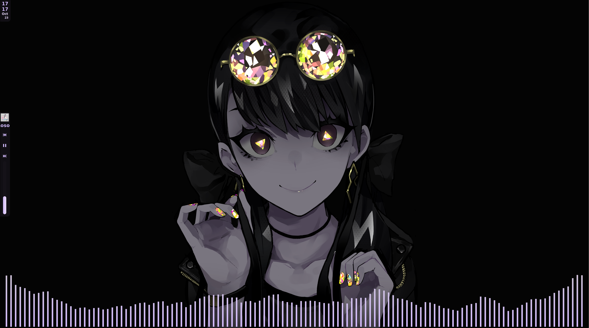

# **HyprLAM**

*A minimalistic dotfile for hyprland desktops, inspired by the works of LAM*

> ⚠️ **Note:** Wallpapers are *not included*.  
> The edits are simple enough to recreate yourself — I cannot redistribute the artist’s works.

🎨 **Credit:**  
Check out [**LAM’s work on Pixiv**](https://www.pixiv.net/en/users/17429)!

---

## Features

- 🎵 **Cava Background** — audio-reactive visualizer  
- 🎧 **Sidebar Spotify** — clean integration for music control  
- 🕓 **Minimalistic Clock and Date** — elegant and unobtrusive display  

## Demo

